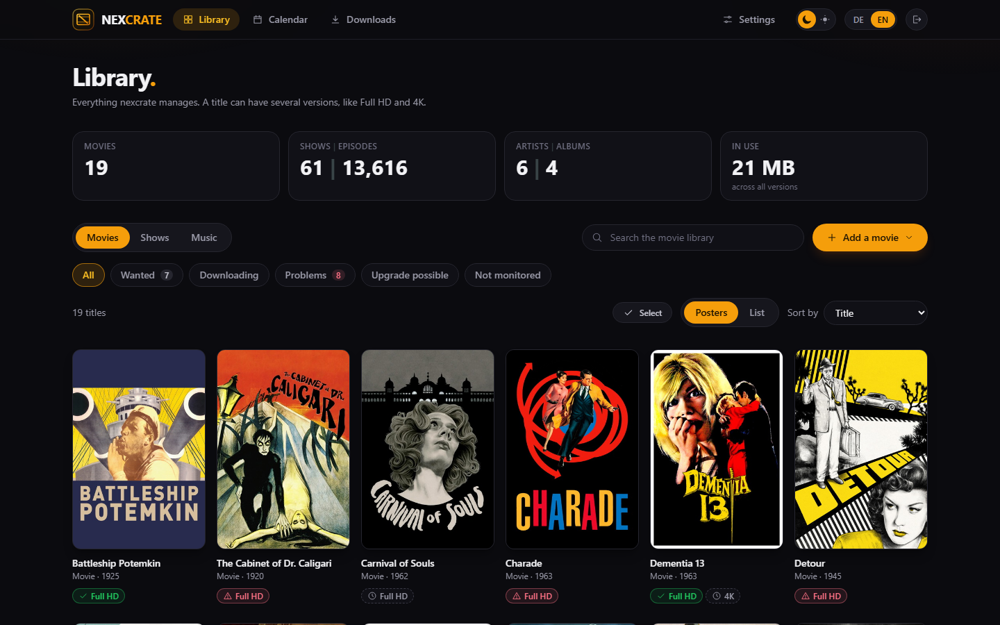
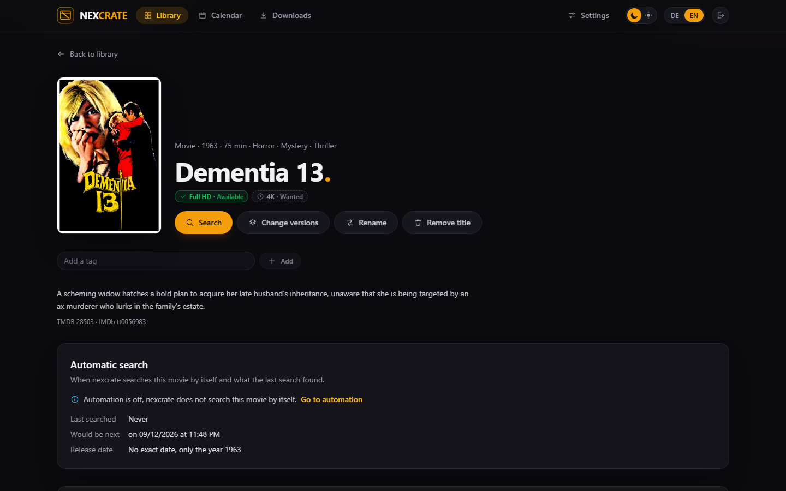
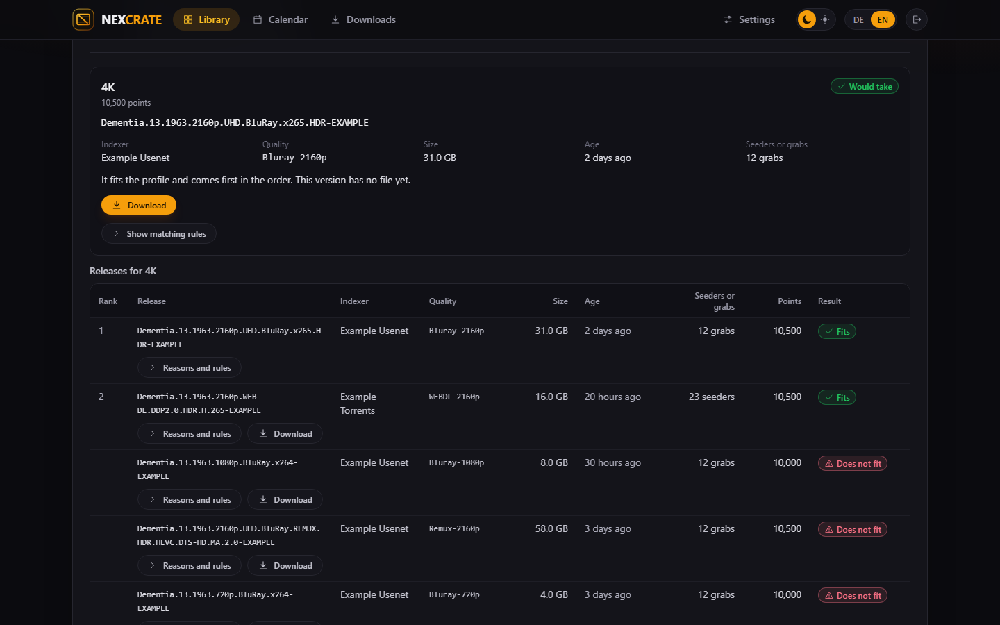
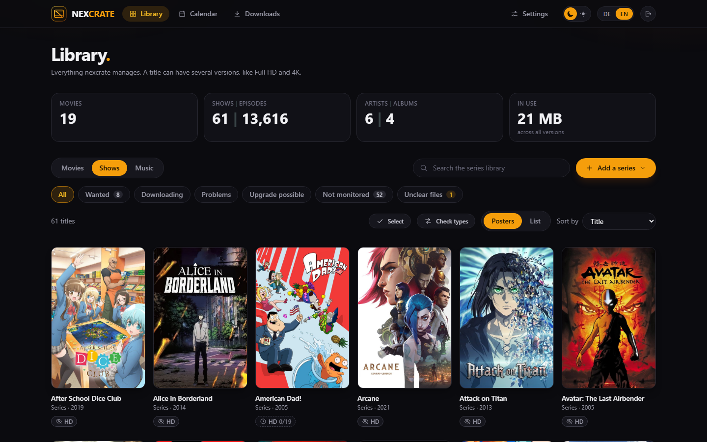
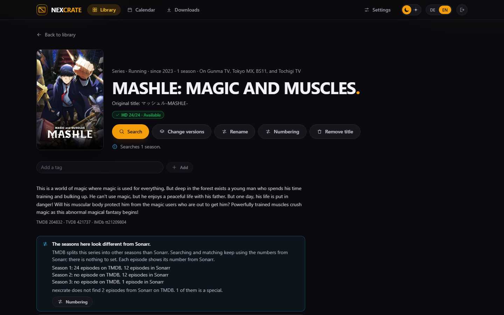
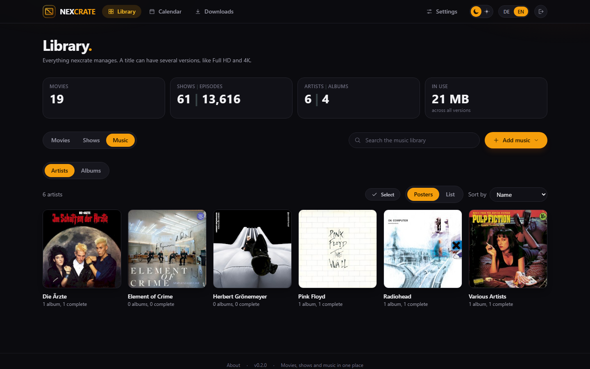
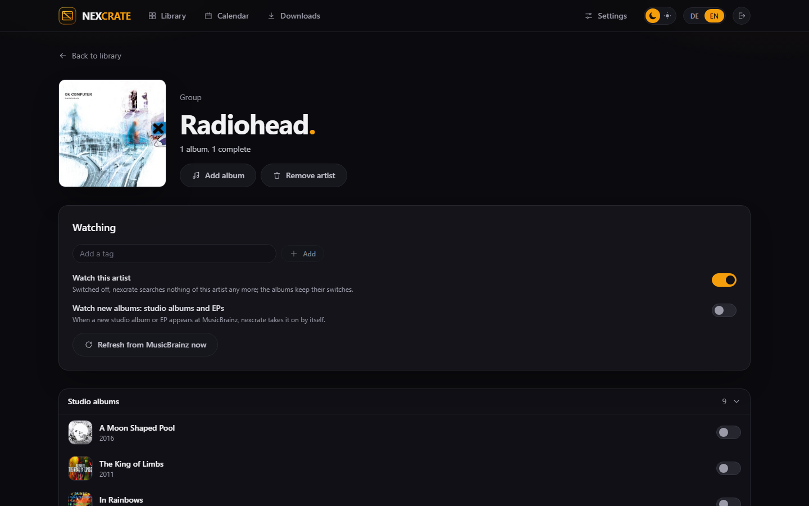
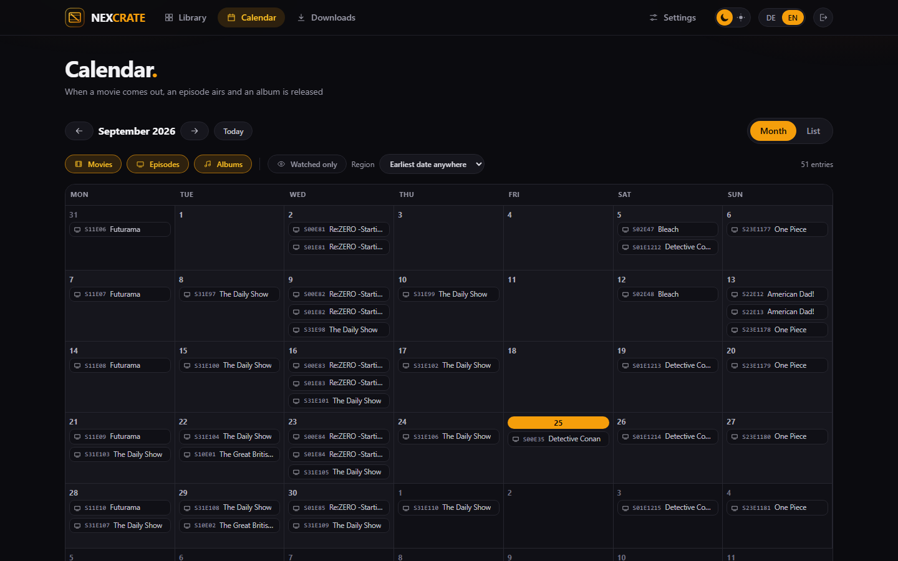
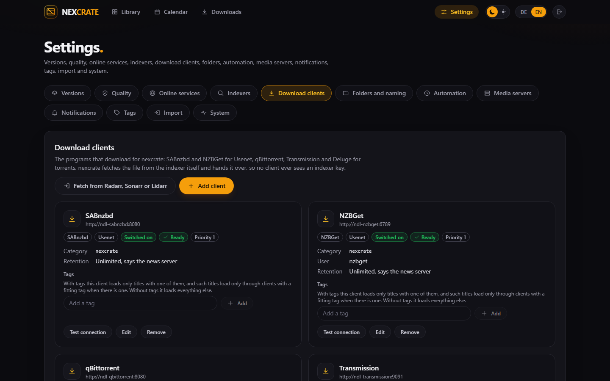

# nexcrate

Movies, shows and music in one self-hosted app, with several versions per title: a movie in
Full HD and 4K, an album in FLAC and MP3. One app instead of Radarr, Sonarr and Lidarr side by
side.



Website: [nexcrate.nexapps.dev](https://nexcrate.nexapps.dev)

The screenshots show a throwaway instance with public-domain movies, a few shows and artists,
and made-up releases.

## What it does

- **Versions:** a title can have several versions, each with its own profile and folder. No
  second instance for 4K.
- **Profiles from everyday questions**, with the rules of the
  [TRaSH Guides](https://trash-guides.info) inside: qualities, custom formats, sizes and scores
  as Radarr and Sonarr use them. An expert mode edits every part by hand, and a profile can be
  read from an existing Radarr or Sonarr.
- **Movies, shows and anime** from TMDB, scene numbering from TheXEM, episodes counted through
  for anime, double episodes, specials.
- **Music** from MusicBrainz: artists, albums and the release that fits best, files matched to
  tracks by tags, names and AcoustID fingerprints, tags written on filing.
- **Search** over Newznab and Torznab indexers, with the decision per version and the reason for
  every release.
- **Downloads** through SABnzbd, NZBGet, qBittorrent, Transmission or Deluge. Torrents are
  hardlinked and keep seeding, Usenet downloads are moved, failed ones are replaced.
- **Automatic search**, RSS and delay rules per version, with a daily limit and a pause for
  upgrades.
- **Switching over** from Radarr, Sonarr and Lidarr: read their library, indexers, download
  clients and profiles, then take the files over; or start from the folders on disk.
- **Rename** whole libraries with a preview and an undo, **library rules** that pick the target
  folder by genre, certification, tag or kind of series.
- **Calendar** with an iCal feed, **notifications** (ntfy, Gotify, Telegram, Discord, webhook,
  Apprise, e-mail), **Plex, Jellyfin and Emby** told about new files, **backups** with an
  encrypted download.
- **An API for other programs** (`/api/v1`) with keys, an event feed and webhooks.

| | |
|---|---|
|  |  |
|  |  |
|  |  |
|  |  |

## Running with Docker

```bash
docker compose up -d
```

The bundled `docker-compose.yml` pulls `ghcr.io/derkezorm/nexcrate:latest`. Open
`http://<your-host>:8390` and create the account.

> ⚠️ **Whoever reaches a fresh installation first can claim it.** Until the account exists,
> anybody who can open the page can create it, and it is the only account there is. Create
> it right after the first start, before the port is reachable from other networks. Once the
> account exists, the setup route is closed for good.

### Forgot the password?

There is one account and no other way back in. Whoever controls the server sets a new one:

```bash
docker exec -it nexcrate python -m app.cli reset-password
```

It asks for the new password twice without showing it, and ends every session.

### The data directory

Everything lives in `/data` (`./data` next to the compose file): the database, the secret key,
the logs and the backups (`data/backups/`).

> ⚠️ **`/data` belongs on a local disk**, never on an SMB or NFS share. SQLite's locking does
> not work reliably over network file systems, and that is how it loses data. On a NAS use a
> path on an internal volume, not a mounted share.

Back up `secret.key` together with the database. Stored credentials, such as API keys of other
programs, are encrypted with it; without it they have to be entered again.

### Media and downloads

nexcrate files into folders it can see inside its container, and you choose them from a list;
there is no path to type. Mount the folder that holds your downloads and your media, for example:

```yaml
    volumes:
      - ./data:/data
      - /srv/data:/media
```

`/data` is nexcrate's own and is never offered as a media folder.

> ⚠️ **Hardlinks work only inside one mount.** Keep the downloads of your download clients and
> your media folders below one host folder and mount that folder once. With two mounts, even of
> the same disk, every torrent is copied and takes its space twice.

- **Categories:** nexcrate keeps its downloads apart under a category of its own, `nexcrate`: a
  category in SABnzbd and qBittorrent, which nexcrate creates; any category in NZBGet, which takes
  one without setup; a subfolder and, from version 4, a label in Transmission; a label in Deluge,
  whose Label plugin nexcrate switches on.
- **Usenet retention** is read from the news servers set up in SABnzbd and NZBGet; a release older
  than the longest retention is left out. There is nothing to enter.
- **Indexer keys stay inside nexcrate.** nexcrate fetches the NZB or torrent file itself and hands
  the file over; no download client ever sees an indexer key.
- **Different paths:** when a download client sees the folder under another path, for example
  `/data` instead of `/media`, nexcrate finds the finished download and asks once to confirm the
  mapping.
- **Recycle bin:** a replaced or deleted file waits in `.nexcrate-recycle` inside its root
  folder, seven days by default, and can be taken back from Settings, Files.

### The library on disk

Every title nexcrate owns carries a small file `release.nex` in its folder (for shows in every
season folder, for albums in the album folder): the TMDB, IMDb or MusicBrainz number and per
version the file, its quality and release. Should the database ever be lost, nexcrate reads the
library back from these files without guessing. Plex, Jellyfin and Emby ignore the file.

### Backups

Settings, System, "Backups". nexcrate copies its database weekly at night (or daily, monthly or
never), before every schema change, and when you ask. **Download** turns a copy into an
AES-encrypted ZIP with the database and `secret.key`, protected by a password you choose.
**Restore** takes such an archive and restarts nexcrate, which swaps it in before anything opens
the database; this needs a restart policy such as `restart: unless-stopped`, which the bundled
`docker-compose.yml` sets.

### Settings

All optional, see `.env.example` and `docker-compose.yml`.

| Variable | Default | Meaning |
|---|---|---|
| `NEXCRATE_DATA_DIR` | `./data` | Database, key, logs, backups |
| `NEXCRATE_SECRET_KEY` | generated in `data/secret.key` | Key for stored credentials |
| `NEXCRATE_COOKIE_SECURE` | `auto` | `auto` follows the scheme of each request, `on` for a reverse proxy that ends TLS, `off` never |
| `NEXCRATE_LOG_LEVEL` | empty | Fixes the log mode: `quiet`, `normal`, `detailed`, `trace` |
| `NEXCRATE_PORT` | `8390` | Port inside the container |
| `NEXCRATE_URL_BASE` | empty | Serve nexcrate under a sub path such as `/nexcrate`; `/api/health` also answers at the root |

### Logs

The log is in `data/logs/` and in the interface, with download. There are four modes: `quiet`,
`normal`, `detailed` and `trace`; the two deep ones switch back to `normal` after 30 minutes,
2 hours or 8 hours. Every answer carries an `X-Request-Id` header that finds the lines of that
request. Secrets are masked before a line is written.

## API

The interface uses the same API anybody can use. Documentation: `/api/docs`, the OpenAPI
document: `/api/openapi.json`. Requests that change something need the header
`X-Requested-With: nexcrate`.

Other programs use `/api/v1`, a contract that stays stable while the routes of the interface
follow its pages. It opens with a key from Settings, System, API keys, sent as
`Authorization: Bearer <key>`. A key is shown once and nexcrate keeps only its hash. Three
scopes: `read` (versions, titles and their state, seasons and episodes, the queue, problems,
history, the calendar, ratings, an event feed also as Server-Sent Events), `request` (request
titles, take requests back, freeze, move files into the recycle bin, ask for a search) and
`operate` (retry, remove, clear and assign the files of a stuck download). A program can also
ask to be connected (`POST /api/v1/pairing`) and collect its key once the owner confirms.
Webhooks send the same events signed with HMAC-SHA256.

## Run from source

Backend on port 8390:

```bash
cd backend
python -m venv .venv
.venv/bin/python -m pip install -r requirements-dev.txt
NEXCRATE_DATA_DIR=../data-dev .venv/bin/python -m uvicorn app.main:app --port 8390 --reload
```

Frontend on port 5390, talking to the backend under `/api`:

```bash
cd frontend
npm ci
npm run dev
```

## Data sources

- [TMDB](https://www.themoviedb.org) for movies and shows: *This application uses TMDB and the
  TMDB APIs but is not endorsed, certified, or otherwise approved by TMDB.* A free TMDB token is
  entered under Settings, Online services.
- [TheXEM](https://thexem.info) for the scene numbering of shows and anime.
- [MusicBrainz](https://musicbrainz.org) and the Cover Art Archive for music,
  [AcoustID](https://acoustid.org) for recognizing files without usable tags.
- The [TRaSH Guides](https://trash-guides.info) (MIT) for the rules inside the profiles.
- IMDb ratings: Information courtesy of IMDb (https://www.imdb.com). Used with permission.
  Rotten Tomatoes and Metacritic with an OMDb key of your own.

TheXEM, MusicBrainz, AcoustID and the IMDb ratings can be switched off under Settings, Online
services. Once a day nexcrate
asks GitHub for its newest release; nothing but the request itself goes out, and it can be
switched off on the About page.

## Licence

[GNU Affero General Public License v3.0](LICENSE).
